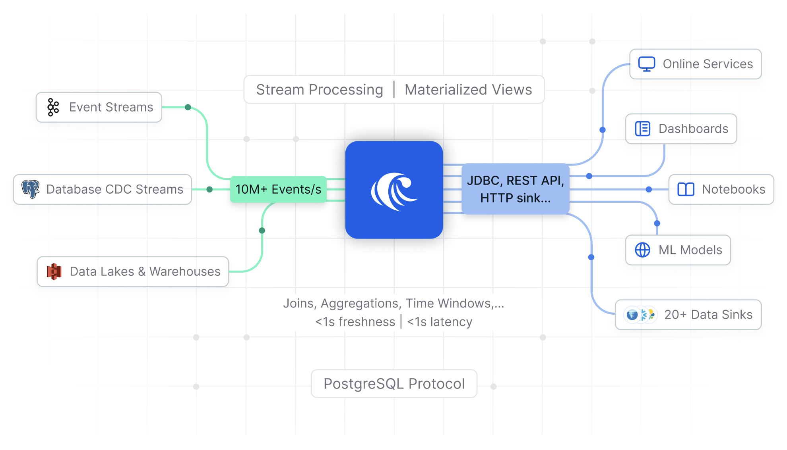

<p align="center">
  <picture>
    <source srcset=".github/RisingWave-logo-dark.svg" width="500px" media="(prefers-color-scheme: dark)">
    
  </picture>
</p>


<div align="center">

### 🌊 Reimagine real-time data engineering.

</div>

<p align="center">&nbsp;&nbsp;&nbsp;📚&nbsp;
  <a
    href="https://docs.risingwave.com/"
    target="_blank"
  ><b>Documentation</b></a>&nbsp;&nbsp;&nbsp;🚀&nbsp;
  <a
    href="https://risingwave.com/slack"
    target="_blank"
  >
    <b>Slack Community</b>
  </a>
</p>
<div align="center">
  <a
    href="https://risingwave.com/slack"
    target="_blank"
  >
    
  </a>
  <a
    href="https://x.com/risingwavelabs"
    target="_blank"
  >
    
  </a>
  <a
    href="https://www.youtube.com/@risingwave-labs"
    target="_blank"
  >
    
  </a>
</div>

RisingWave is a Postgres-compatible SQL database engineered to provide the <i><b>simplest</b></i> and <i><b>most cost-efficient</b></i> approach for <b>processing</b>, <b>analyzing</b>, and <b>managing</b> real-time event streaming data.

RisingWave can <b>ingest</b> millions of events per second, continuously <b>join and analyze</b> live data streams with historical tables, <b>serve</b> ad-hoc queries in real-time, and <b>deliver</b> fresh, consistent results wherever needed.



## Try it out in 60 seconds

Install RisingWave standalone mode:
```shell
curl https://risingwave.com/sh | sh
```

To learn about other installation options, such as using a Docker image, see [Quick Start](https://docs.risingwave.com/docs/current/get-started/).

## When is RisingWave the perfect fit?
RisingWave is the ideal solution for:

* Managing real-time data sources like Kafka streams, database CDC, and more.
* Executing complex, on-the-fly queries, including joins, aggregations, and time windowing.
* Interactively and concurrently exploring consistent, up-to-the-moment results.
* Seamlessly delivering results to downstream systems.
* Processing both streaming and batch data with a unified codebase.


## In what use cases does RisingWave excel?
RisingWave is particularly effective for the following use cases:

* **Streaming analytics**: Achieve sub-second data freshness in live dashboards, ideal for high-stakes scenarios like stock trading, sports betting, and IoT monitoring.
* **Event-driven applications**: Develop sophisticated monitoring and alerting systems for critical applications such as fraud and anomaly detection.
* **Real-time data enrichment**: Continuously ingest data from diverse sources, conduct real-time data enrichment, and efficiently deliver the results to downstream systems.
* **Feature engineering**: Transform batch and streaming data into features in your machine learning models using a unified codebase, ensuring seamless integration and consistency.

## Production deployments

[**RisingWave Cloud**](https://cloud.risingwave.com) offers the easiest way to run RisingWave in production.

For **Docker deployment**, please refer to [Docker Compose](https://docs.risingwave.com/docs/current/risingwave-docker-compose/).

For **Kubernetes deployment**, please refer to [Kubernetes with Helm](https://docs.risingwave.com/docs/current/risingwave-k8s-helm/) or [Kubernetes with Operator](https://docs.risingwave.com/docs/current/risingwave-kubernetes/).

## Community

Looking for help, discussions, collaboration opportunities, or a casual afternoon chat with our fellow engineers and community members? Join our [Slack workspace](https://risingwave.com/slack)!

## Notes on telemetry


RisingWave uses [Scarf](https://scarf.sh/) to collect anonymized installation analytics. These analytics help support us understand and improve the distribution of our package. The privacy policy of Scarf is available at [https://about.scarf.sh/privacy-policy](https://about.scarf.sh/privacy-policy).

RisingWave also collects anonymous usage statistics to better understand how the community is using RisingWave. The sole intention of this exercise is to help improve the product. Users may opt out easily at any time. Please refer to the [user documentation](https://docs.risingwave.com/docs/current/telemetry/) for more details.

## License

RisingWave is distributed under the Apache License (Version 2.0). Please refer to [LICENSE](LICENSE) for more information.

## Contributing

Thanks for your interest in contributing to the project! Please refer to [RisingWave Developer Guide](https://risingwavelabs.github.io/risingwave/) for more information.
