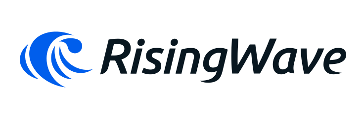
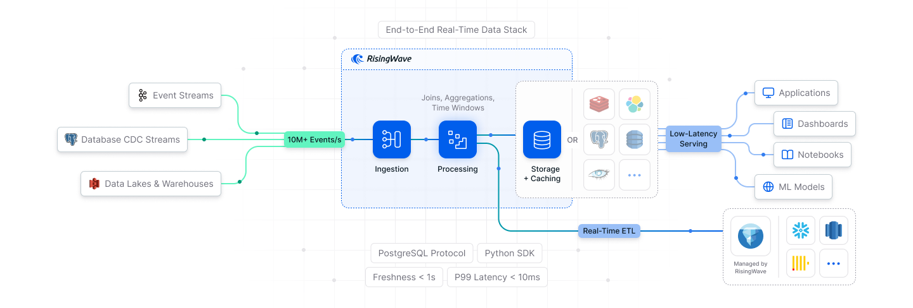

<p align="center">
  <picture>
    <source srcset=".github/RisingWave-logo-dark.svg" width="500px" media="(prefers-color-scheme: dark)">
    
  </picture>
</p>


<div align="center">

### 🌊 Ride the Wave of Streaming Data.

</div>
<p align="center">
  <a href="https://docs.risingwave.com/">Docs</a> | <a href="https://docs.risingwave.com/get-started/rw-benchmarks-stream-processing">Benchmarks</a> | <a href="https://docs.risingwave.com/demos/overview">Demos</a>
</p>

<p align="center">

<div align="center">
  <a
    href="https://go.risingwave.com/slack"
    target="_blank"
  >
    
  </a>
  <a
    href="https://x.com/risingwavelabs"
    target="_blank"
  >
    
  </a>
  <a
    href="https://www.youtube.com/@risingwave-labs"
    target="_blank"
  >
    
  </a>
</div>

RisingWave is the world's most advanced event stream processing platform engineered to provide the <i><b>simplest</b></i> and <i><b>most cost-efficient</b></i> approach for <b>processing</b>, <b>analyzing</b>, and <b>managing</b> real-time event streaming data. It provides both a Postgres-compatible [SQL interface](https://docs.risingwave.com/sql/overview) and a DataFrame-style [Python interface](https://docs.risingwave.com/python-sdk/intro).

RisingWave can <b>ingest</b> millions of events per second, continuously <b>join and analyze</b> live data streams with historical tables, <b>serve</b> ad-hoc queries at low latency, and <b>deliver</b> fresh, consistent results wherever needed.



## Try it out in 60 seconds

Install RisingWave standalone mode:
```shell
curl -L https://risingwave.com/sh | sh
```

To learn about other installation options, such as using a Docker image, see [Quick Start](https://docs.risingwave.com/docs/current/get-started/).

## Not just a stream processor!

RisingWave simplifies **end-to-end** development of real-time data pipelines and applications - going beyond traditional stream processors.

Like other stream processors, RisingWave supports:

* **Ingestion:** Ingest millions of events per second from streaming and batch sources.
* **Stream processing:** Perform real-time incremental processing to join and analyze live data with historical tables.
* **Delivery:** Deliver fresh, consistent results to data lakes (e.g., Apache Iceberg) or any destination.

But RisingWave does more. It provides both **online and offline storage**:

* **Online serving:** Row-based storage for ad-hoc point/range queries with single-digit millisecond latency.
* **Offline persistence:** Apache Iceberg-based storage that persists streaming data at low cost, enabling open access by other query engines.

## Key design decisions

RisingWave is designed to be easier to use and more cost-efficient:

### PostgreSQL compatibility

* **Seamless integration:** Connects via the PostgreSQL wire protocol, working with psql, JDBC, and any Postgres tool.
* **Expressive SQL:** Supports structured, semi-structured, and unstructured data with a familiar SQL dialect.
* **No manual state tuning:** Eliminates complex state management configurations.

### S3 as primary storage

RisingWave stores tables, materialized views, and internal states of stream processing jobs in S3 (or equivalent object storage), providing:
- **High performance:** Optimized for complex queries, including joins and time windowing.
- **Fast recovery:** Restores from system failures within seconds.
- **[Dynamic scaling](https://docs.risingwave.com/deploy/k8s-cluster-scaling):** Instantly adjusts resources to handle workload spikes.

### Elastic disk cache

Beyond caching hot data in memory, RisingWave supports [**elastic disk cache**](https://docs.risingwave.com/get-started/disk-cache), a powerful performance optimization that uses local disks or EBS for efficient data caching. This minimizes access to S3, lowering processing latency and cutting S3 access costs.

## In what use cases does RisingWave excel?
RisingWave is particularly effective for the following use cases:

* **Streaming analytics**: Achieve sub-second data freshness in live dashboards, ideal for high-stakes scenarios like stock trading, sports betting, and IoT monitoring.
* **Event-driven applications**: Develop sophisticated monitoring and alerting systems for critical applications such as fraud and anomaly detection.
* **Real-time data enrichment**: Continuously ingest data from diverse sources, conduct real-time data enrichment, and efficiently deliver the results to downstream systems.
* **Feature engineering**: Transform batch and streaming data into features in your machine learning models using a unified codebase, ensuring seamless integration and consistency.

## Production deployments

[**RisingWave Cloud**](https://cloud.risingwave.com) offers the easiest way to run RisingWave in production.

For **Docker deployment**, please refer to [Docker Compose](https://docs.risingwave.com/docs/current/risingwave-docker-compose/).

For **Kubernetes deployment**, please refer to [Kubernetes with Helm](https://docs.risingwave.com/docs/current/risingwave-k8s-helm/) or [Kubernetes with Operator](https://docs.risingwave.com/docs/current/risingwave-kubernetes/).

## Community

Looking for help, discussions, collaboration opportunities, or a casual afternoon chat with our fellow engineers and community members? Join our [Slack workspace](https://risingwave.com/slack)!

## Notes on telemetry


RisingWave uses [Scarf](https://scarf.sh/) to collect anonymized installation analytics. These analytics help support us understand and improve the distribution of our package. The privacy policy of Scarf is available at [https://about.scarf.sh/privacy-policy](https://about.scarf.sh/privacy-policy).

RisingWave also collects anonymous usage statistics to better understand how the community is using RisingWave. The sole intention of this exercise is to help improve the product. Users may opt out easily at any time. Please refer to the [user documentation](https://docs.risingwave.com/docs/current/telemetry/) for more details.

## License

RisingWave is distributed under the Apache License (Version 2.0). Please refer to [LICENSE](LICENSE) for more information.

## Contributing

Thanks for your interest in contributing to the project! Please refer to [RisingWave Developer Guide](https://risingwavelabs.github.io/risingwave/) for more information.
