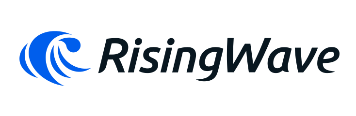
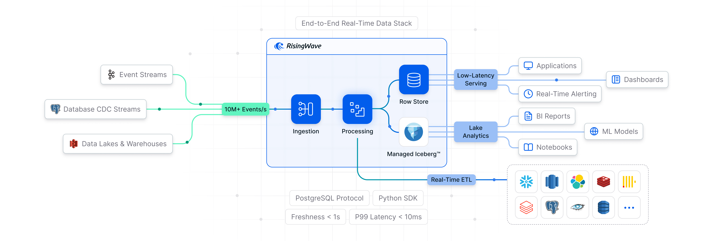

<p align="center">
  <picture>
    <source srcset=".github/RisingWave-logo-dark.svg" width="500px" media="(prefers-color-scheme: dark)">
    
  </picture>
</p>


<div align="center">

### 🌊 Event Streaming for Agentic AI

</div>
<p align="center">
  <a href="https://docs.risingwave.com/">Docs</a> | <a href="https://docs.risingwave.com/get-started/rw-benchmarks-stream-processing">Benchmarks</a> | <a href="https://docs.risingwave.com/demos/overview">Demos</a> | <a href="https://risingwave.com/customers/">Case Studies</a>
</p>

<p align="center">

<div align="center">
  <a
    href="https://github.com/risingwavelabs/risingwave/releases/latest"
    target="_blank"
  >
    
  </a>
  <a
    href="https://go.risingwave.com/slack"
    target="_blank"
  >
    
  </a>
  <a
    href="https://x.com/risingwavelabs"
    target="_blank"
  >
    
  </a>
  <a
    href="https://www.youtube.com/@risingwave-labs"
    target="_blank"
  >
    
  </a>
</div>

RisingWave is an event streaming platform for agentic AI. It continuously ingests data from databases, event streams, and webhooks, processes it incrementally, and serves fresh results at low latency, replacing the traditional event streaming stack (e.g., Debezium + Kafka + Flink + serving DB) with a single system.



---

## Try it out in 60 seconds

```shell
curl -L https://risingwave.com/sh | sh
```

For Docker, Kubernetes, and other options, see the [quick start guide](https://docs.risingwave.com/get-started/quickstart).

---

## The problem

Agents and real-time applications need data that is always fresh and queryable at low latency. The standard approach chains together Debezium for CDC, Kafka for transport, Flink for processing, and a database for serving. Each hop adds latency and each system adds operational overhead.

RisingWave replaces the whole stack: ingest, process, serve, store.

---

## How it works

### Ingest from any source

RisingWave ingests across the full data spectrum:

- **Webhooks**: HTTP-based event ingestion from SaaS applications and external systems
- **Database changes**: native CDC from PostgreSQL, MySQL, and others via transaction log reading
- **Event streams**: Kafka, Pulsar, Kinesis, and other message brokers
- **Historical data**: batch ingestion from S3, data warehouses, and other storage systems

All sources are unified under the same SQL interface. Streams and tables can be joined freely.

### Process continuously

RisingWave performs incremental computation over ingested data. When upstream data changes, only the affected results are recomputed. End-to-end freshness is under 100 ms.

This is the core mechanism behind everything RisingWave does: materialized views that are always up to date, without full recomputation on every query.

### Serve at low latency

Query results are maintained in RisingWave's internal row store and served at 10-20 ms p99 latency. Agents and applications query this layer directly using standard SQL. No polling, no cache warming, no TTL management.

### Store in Apache Iceberg™

For long-term retention and analytical access, RisingWave writes to Apache Iceberg™ tables. It hosts the Iceberg REST catalog directly and handles table maintenance — compaction, small-file optimization, snapshot cleanup — without external tooling. Iceberg queries are executed via [Apache DataFusion](https://datafusion.apache.org/), a vectorized query engine. Because Iceberg is an open format, data is also readable by Spark, Trino, DuckDB, and other engines.

The row store and Iceberg layer serve different purposes: the row store is for low-latency serving, Iceberg is for durable, open-format storage and analytical queries. RisingWave manages both.

---

## Use cases

- **Monitoring and alerting**: continuous evaluation of streaming metrics against thresholds
- **Feature store**s: batch and streaming features computed over the same pipeline, served from the same system
- **Live dashboards**: materialized views updated incrementally, no scheduled refreshes
- **Real-time enrichment**: live events joined with historical reference data in-flight, before delivery downstream
- **Streaming lakehouses**: continuous, exactly-once ingestion into open-format tables with automated compaction and snapshot management

---

## Design decisions

### Ultimate cost efficiency

Internal state, tables, and materialized views are stored in object storage (S3 or equivalent), which is roughly 100x cheaper than RAM. This enables elastic scaling without data rebalancing and failure recovery in seconds. For latency-sensitive workloads, [elastic disk cache](https://docs.risingwave.com/get-started/disk-cache) pins hot data on local SSD or EBS, keeping p99 query latency at 10-20 ms.

### Native experience for both humans and agents

RisingWave connects via the PostgreSQL wire protocol and works with psql, JDBC, and any Postgres-compatible tooling. For agents, RisingWave provides a MCP server, a CLI, and Skills, so agents can query and operate RisingWave without custom integration.

### Openness

RisingWave [natively integrates with Apache Iceberg™](https://docs.risingwave.com/iceberg/overview) for continuous stream ingestion, direct reads via DataFusion, and automated table maintenance. Data in Iceberg is in an open format and accessible to any compatible query engine.

---

## Deployment

[**RisingWave Cloud**](https://cloud.risingwave.com) is the managed option.

For self-hosted:
- [Docker Compose](https://docs.risingwave.com/deploy/risingwave-docker-compose/)
- [Kubernetes with Helm](https://docs.risingwave.com/deploy/risingwave-k8s-helm/)
- [Kubernetes with Operator](https://docs.risingwave.com/deploy/risingwave-kubernetes/)

---

## Community

Join us on [Slack](https://go.risingwave.com/slack) for questions, discussions, and contributions.

---

## Telemetry

RisingWave uses [Scarf](https://scarf.sh/) for anonymized installation analytics and collects anonymous usage statistics to improve the product. Both can be opted out. See the [telemetry documentation](https://docs.risingwave.com/operate/telemetry/) for details.

---

## License

Apache License 2.0. See [LICENSE](LICENSE).

## Contributing

See the [RisingWave Developer Guide](https://risingwavelabs.github.io/risingwave/).
