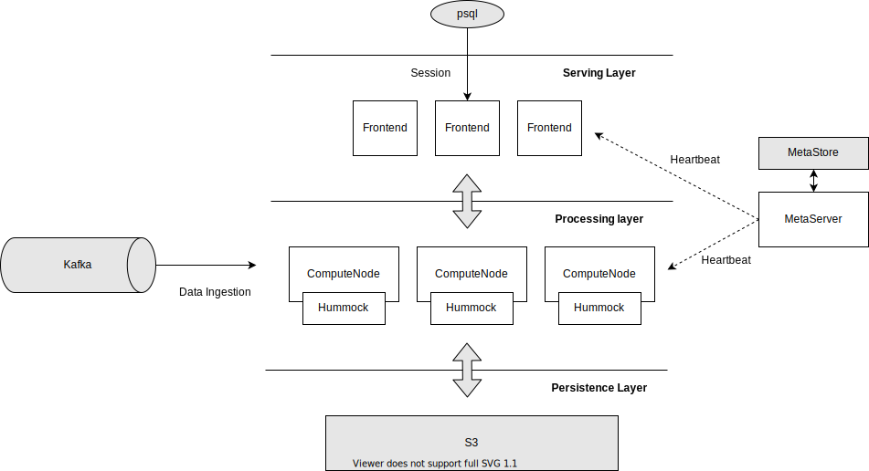

# Architecture Design

## Motivation 

This document serves as one of the materials for newcomers to learn the high-level architecture and the functionalities of each component.

## Architecture 

There are currently 3 types of nodes in the cluster: 

* **Frontend**: Frontend is a stateless proxy that accepts user queries through Postgres protocol. It is responsible for parsing, validation, optimization, and answering the results of each individual query. 
* **ComputeNode**: ComputeNode is responsible for executing the optimized query plan. 
* **MetaServer**: The central metadata management service. It also acts as a failure detector that periodically sends heartbeats to frontends and compute-nodes in the cluster.



The topmost component is the Postgres client. It issues queries through [TCP-based Postgres wire protocol](https://www.postgresql.org/docs/current/protocol.html).

The leftmost component is the streaming data source. [Kafka](https://kafka.apache.org) is the most representative system for streaming sources. Alternatively, [Redpanda](https://redpanda.com/), [Apache Pulsar](https://pulsar.apache.org/), [AWS Kinesis](https://aws.amazon.com/kinesis), [Google Pub/Sub](https://cloud.google.com/pubsub/docs/overview) are also widely-used. Streams from Kafka will be consumed and processed through the pipeline in the database. 

The bottom-most component is AWS S3, or MinIO (an open-sourced s3-compatible system). We employed disaggregated architecture in order to elastically scale the compute-nodes without migrating the storage.

## Execution Mode 

There are 2 execution modes in our system serving different analytics purposes. 

### Batch-Query Mode 

The first is the *batch-query mode*. Users issue such a query via a *SELECT statement* and the system answers immediately. This is the most typical RDBMS use case. 

Let's begin with a simple SELECT and see how it is executed. 

```sql
SELECT SUM(t.quantity) FROM t group by t.company;
```



The query will be sliced into multiple *plan fragments*, each being an independent scheduling unit and probably with different parallelism. For simplicity, parallelism is usually set to the number of compute-nodes in the cluster.

Each parallel unit is called a *task*. Specifically, PlanFragment 2 will be distributed as 3 tasks to 3 compute-nodes.



Behind the TableScan operator, there's a storage engine called Hummock that stores the internal states, materialized views, and the tables. Note that only the materialized views and tables are queryable. The internal states are invisible to users.

To know more about Hummock, you can check out "[An Overview of RisingWave State Store](./state-store-overview.md)".

### Streaming Mode 

The other execution mode is the *streaming mode*. Users build streaming pipelines via [CREATE MATERIALIZED VIEW statement](https://www.postgresql.org/docs/current/sql-creatematerializedview.html). 
For example: 

```sql
CREATE MATERIALIZED VIEW mv1 AS SELECT SUM(t.quantity) as q FROM t group by t.company;
```


When the data source (Kafka, e.g.) propagates a bunch of records into the system, the materialized view will refresh automatically.

Assume that we have a sequence `[(2, "AMERICA"), (3, "ASIA"), (4, "AMERICA"), (5, "ASIA")]`. After the sequence flows through the DAG, the MV will be updated to: 

| A | B
| - | -
| 6 | AMERICA
| 8 | ASIA

When another sequence `[(6, "EUROPE"), (7, "EUROPE")]` comes, the MV will soon become: 

| A | B
| - | -
| 6 | AMERICA
| 8 | ASIA
| 13 | EUROPE

`mv1` can also act as other MV's source. For example, mv2, mv3 can reuse the processing results of mv1 thus deduplicating the computation.

The durability of materialized views in RisingWave is built upon a snapshot-based mechanism. Every time a snapshot is triggered, the internal states of each operator will be flushed to S3. Upon failover, the operator recovers from the latest S3 checkpoint. 

Since the streaming states can be extremely large that are probably unable (or ineffective) to be entirely held in memory, we have designed Hummock to be highly scalable. Compared to [Flink's rocksdb-based state store](https://nightlies.apache.org/flink/flink-docs-release-1.14/docs/ops/state/state_backends/#the-embeddedrocksdbstatebackend), Hummock is cloud-native  and provides super elasticity.

For more details of streaming engine, please refer to "[An Overview of RisingWave Streaming Engine](./streaming-overview.md)".
