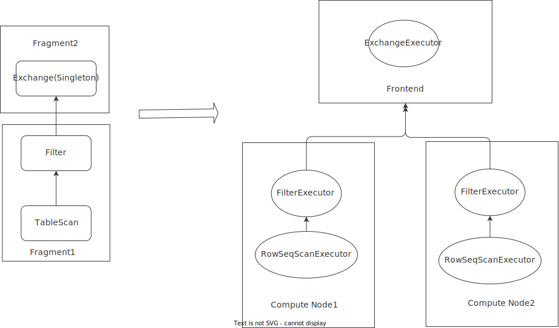
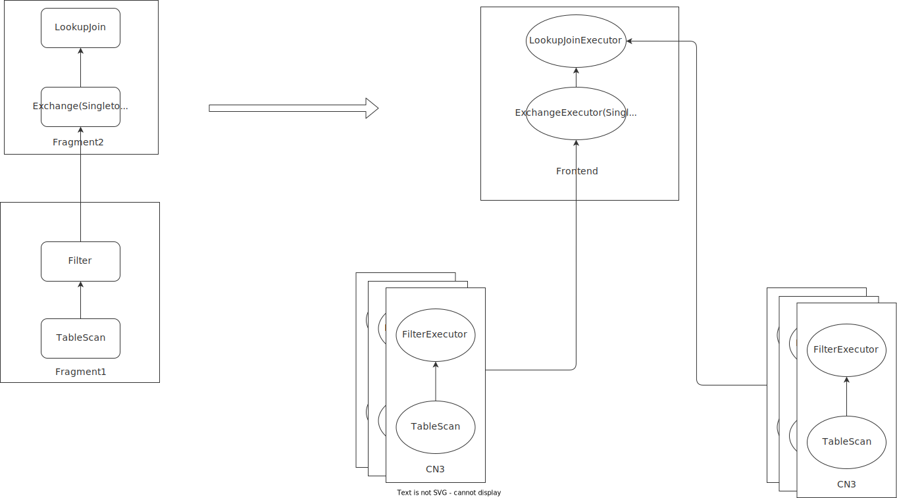

# Design: Local execution mode for online serving queries

## Background

The query engine of risingwave is expected to support two kinds of query: highly concurrent point query and adhoc query.
The characteristics of these two different kinds of queries are summarized as followings:

|	|Point Query	|Adhoc query	|
|---	|---	|---	|
|Latency	|several ms	|ms to minutes	|
|QPS	|1000 ~ 100000	|100 ~ 1000	|
|SQL	|Simple	|Arbitrary complex	|
|Result Set	|Small	|Small, Medium, Large	|
|Use Case	|Dashboard	|Engineers, Data Scientist	|

Our distributed query processing engine is designed for complex adhoc query, and it can’t meet the latency/qps 
requirement of point query, and in this article we introduce local execution mode for point query.

## Design


## Example 1: select a from t where b in (1, 2, 3, 4)

Let’s use above sql as example:




The key changes from distributed mode:

1. The exchange executor will be executed directly by local query execution, not by distributed scheduler. This means that we no longer have async execution/monitoring, etc.
2. The rpc is issued by exchange executor directly, not by scheduler.

## Example2: SELECT pk, t1.a, t1.fk, t2.b FROM t1, t2 WHERE t1.fk = t2.pk AND t1.pk = 114514

Following is the plan and execution of above sql in local mode:




As explained above, the lookup join/exchange phase will be executed directly on frontend. The pushdown(filter/table, both the build and probe side) will be issued by executors rather than scheduler.

### Optimization/Scheduling

The overall process will be quite similar to distributed processing, but with a little difference:

1. We only use heuristic optimizater for it, and only a limited set of rules will be applied.
2. No scheduler will involve, and the physical plan is executed in current thread(coroutine) immeidately.

### Monitoring/Management

Local execution mode will not go through query management mentioned in  batch query manager to reduce latency as 
much as possible.

### How to switch between local/distributed execution mode

As mentioned in first paragraph, the main use case for local execution mode is determined(dashboard/reporting), so currently we just expose a session configuration(`query_mode`) to user. In future we may use optimizer to determined it, but it depends on requirement.

### RPC execution in local mode

In distributed mode we have several steps to execute compute task and fetch results:

There are some problems with above process in local mode:

1. We need at least two rpcs to fetch task execution result, this increases query overhead
2. We have task lifecycle management APIs, this is unnecessary for local mode.
3. We may need to add several new apis for task monitoring/failure detection


For local mode we will add a new rpc api:

```
rpc Execute(ExecuteRequest) returns (ExecuteResponse)

message ExecuteRequest {
 batch_plan.PlanFragment plan = 2;
 uint64 epoch = 3;
}

message ExecuteResponse {
  common.Status status = 1;
  data.DataChunk record_batch = 2;
}
```

This is quite similar to distributed execution api, but with some differences:

1. Response is returned directly in rpc call, without the need of another call
2. No task lifecycle management/monitoring is involved, and if it fails, we just remove the task and return error in response directly.
