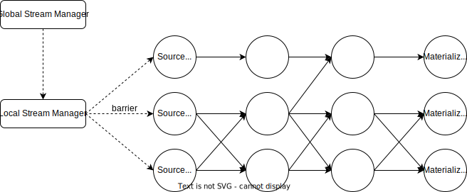

# Checkpoint

## Revisit: Consistency Model

Similar to other relational databases, RisingWave provides consistent snapshot reads on both tables and materialized views. Specifically,

1. **Consistency.** Given a query Q and the latest event timestamp t, the system returns a result Q(t′​) such that Q(t′​) is consistent on a timestamp t′≤t , i.e. evaluating Q over a snapshot S(t′)​ from a previous timestamp t′≤t, where S(t′) is the set of all tuples presented before timestamp t′. That is, the system delivers a query result that is consistent with a previous timestamp t′. 
2. **Monotonicity.** For any two timestamps t1​ and t2​ such that t1​<t2​, assume the result for Q on t1​ and t2​ are consistent with snapshots on t1′​ and t2′​ respectively, then t1′​<t2′​. That is, later queries should not return results that correspond to earlier snapshots. 

Note that RisingWave does **not** guarantee a write must be visible to subsequence reads, a.k.a. the read-after-write consistency. Users may use the `FLUSH` command to make sure the changes have taken effect before reads.

Internally, the upcoming changes may take a while to propagate from sources to materialized views, and at least one barrier event is required to flush the changes. Such two kinds of latency determine the latency between write and read.

## Streaming Checkpoint

The consistent checkpoints play 2 roles in our system.

1. Fault-tolerance. To recover the cluster from an unexpected failure, every stateful streaming operator needs to recover their states from a consistent checkpoint.
2. Consistent snapshot. The snapshot to be read is actually the latest completed checkpoint. As the previous section discussed, it's required to guarantee the data of tables & materialized views consistent in one snapshot.

RisingWave makes checkpointing via [Chandy–Lamport algorithm](https://en.wikipedia.org/wiki/Chandy%E2%80%93Lamport_algorithm). A special kind of message, checkpoint barriers, is generated on streaming source and propagates across the streaming graph to the materialized views (or sink).

To guarantee consistency, RisingWave introduces Chandy-Lamport algorithm as its checkpoint scheme.
In particular, RisingWave periodically (every `barrier_interval_ms`) repeats the following procedure:

1. The meta service initializes a barrier and broadcasts it to all source actors across the streaming engine. 
2. The barrier messages go through every streaming operator (actors) in the streaming graph. 
   - For fan-out operators like `Dispatch`, the barrier messages are copied to every downstream.
   - For fan-in operators like `Merge` or `Join`, the barrier messages are collected and emitted out once collected from all upstreams. 
   - For other operators, the barrier messages flow through the operators and trigger a checkpoint operation on them. Namely, flush the changes into storage.
3. When all dirty states from a compute node are flushed to storage, the compute node sends a finish signal to the meta service.
4. After receiving the finish signal from all compute nodes, the meta service tells the storage manager to commit the checkpoint and finishes the checkpoint procedure.

## Checkpoint on Storage

As is mentioned before, during checkpointing, every operator writes their changes of this epoch into storage. For the storage layer, these data are still uncommitted, i.e. not persisted to the shared storage. However, the data still need to be visible to that operator locally.

A local shared buffer is introduced to stage these uncommitted write batches. Once the checkpoint barriers have pass through all actors, the storage manager can notify all compute nodes to 'commit' their buffered write batches into the shared storage.

Another benefit of shared buffer is that the write batches in a compute node can be compacted into a single SSTable file before uploading, which significantly reduces the number of SSTable files in Layer 0.
