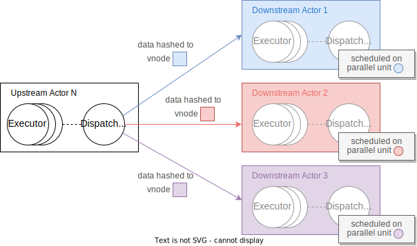

# Consistent Hash

## Background

Scaling could occur for multiple reasons in RisingWave. For example, when workload of some streaming operator is heavier than expected, we need to scale out. During scaling out or scaling in, physical resources will be allocated or freed accordingly. That is to say, new [actors](./streaming-overview.md#actors) will be created on scaling out, while some old actors will be dropped on scaling in. As a result of actor change, redistributing data (i.e. states of the actors) is required inevitably. That yields a question: how to efficiently determine the distribution of data and minimize data movement on scaling?

On the other hand, we need to parallel the scan on tables or materialized views in [batch query mode](./architecture-design.md#batch-query-mode). Therefore, we need to partition the data in a way that could boost the performance most. So what is the most beneficial way of data partition for tables and materialized views?

In RisingWave, we adopt consistent-hash-based strategy to solve the two problems above. This document will elaborate on our design.

## Design

### Meta

#### Actor Scheduling

First, we need to introduce a little about how we schedule the actors. Each worker node in RisingWave cluster will have a number of parallel units. A parallel unit is the minimal scheduling unit in RisingWave, as well as the physical location of an actor. Each actor will be scheduled to exactly one parallel unit.

#### Data Distribution

Here comes the main part, where we will construct a mapping that determines data distribution.

For all data $k \in U_k$, where $U_k$ is an unbounded set, we apply a hash function $v = H(k)$, where $v$ falls to a limited range. The hash function $H$ ensures that all data are hashed **uniformly** to that range. We call $v$ vnode, namely virtual node, as is shown as the squares in the figure below.


Then we have vnode mapping, which ensures that vnodes are mapped evenly to parallel units in the cluster. In other words, the number of vnodes that are mapped to each parallel unit should be as close as possible. This is denoted by different colors in the figure above. As is depicted, we have 3 parallel units (shown as circles), each taking $\frac{1}{3}$ of total vnodes. Vnode mapping is [constructed and maintained by meta](https://github.com/risingwavelabs/risingwave/blob/main/src/meta/src/stream/scheduler.rs).

As long as the hash function $H$ could ensure uniformity, the data distribution determined by this strategy would be even across physical resources. The evenness will be retained even if data in $U_k$ are skewed to a certain range, say, most students scoring over 60 in a hundred-mark system.

#### Data Redistribution

Since $v = H(k)$, the way that data are mapped to vnodes will be invariant. Therefore, when scaling occurs, we only need to modify vnode mapping (the way that vnodes are mapped to parallel units), so as to redistribute the data.

Let's take scaling out for example. Assume that we have one more parallel unit after scaling out, as is depicted as the orange circle in the figure below. Using the optimal strategy, we modify the vnode mapping in such a way that only $\frac{1}{4}$ of the data have to be moved, as is shown in the figure below. The vnodes whose data are required to be moved are highlighted with bold border in the figure.


To minimize data movement when scaling occurs, we should be careful when we modify the vnode mapping. Below is an opposite example. Modifying vnode mapping like this will result in $\frac{1}{2}$ of the data being moved.


### Streaming

We know that a fragment has several actors as its different parallelisms, and that upstream actors will send data to downstream actors via [dispatcher](./streaming-overview.md#actors). The figure below illustrates how actors distribute data based on consistent hash by example. 



In the figure, we can see that one upstream actor dispatches data to three downstream actors. The downstream actors are scheduled on the parallel units mentioned in previous example respectively. 

Based on our consistent hash design, the dispatcher is informed of the latest vnode mapping by meta node. It then decides how to send data by following steps:
1. Compute vnode of the data via the hash function $H$. Let the vnode be $v_k$.
2. Look up vnode mapping and find out parallel unit $p_n$ that vnode $v_k$ maps to. 
3. Send data to the downstream actor that is scheduled on parallel unit $p_n$ (remember that one actor will be scheduled on exactly one parallel unit).

In this way, all actors' data (i.e. actors' states) will be distributed according to the vnode mapping constructed by meta. 

When scaling occurs, actors will be re-scheduled accordingly. By modifying the vnode mapping in meta and make streaming act on the new vnode mapping, we could minimize data movement from following aspects:

- The data of existing actors will not be displaced too much. 
- The block cache of a compute node will not be invalidated too much.

### Batch

When we perform parallel batch read, we should partition the data for each parallelism in some way. Now that we have vnodes corresponding to disjoint sets of data, this naturally forms a data partition pattern: one vnode could be viewed as a minimal data partition unit, and we could aggregate several vnodes together to get a larger data partition.

In vnode mapping introduced above, one parallel unit will correspond to several vnodes, so we could view vnodes that are mapped to one parallel unit as one partition group. In [the figure above](#data-distribution), namely, a partition group is vnodes with the same color (or the data that are hashed to these vnodes).

This is better than range partition in that this approach of partition is more stable when the primary key of a materialized view distributes non-randomly, for example, monotonically increasing.

### Storage

If we look into the read-write pattern of streaming actors, we'll find that in most cases, actors only need to read the data written by itself (i.e. actor's internal states). Namely, read data with the same vnodes as it previously writes. 

Therefore, an instinctive way to place data in storage is to **group data by vnodes**. In this way, when actors perform read operation, they could touch as few SST blocks as possible and thus trigger less I/O. 

We know that [Hummock](./state-store-overview.md#overview), our LSM-Tree-based storage engine, sorts key-value pairs by the order of the key. Hence, in order to group data by vnode on the basis of Hummock, we **encode vnode into the storage key**. The storage key will look like
```
table_id | vnode | ...
```
where `table_id` denotes the [state table](relational_table/storing-state-using-relational-table.md#relational-table-layer), and `vnode` is computed via $H$ on key of the data. 

To illustrate this, let's revisit the [previous example](#streaming). Executors of an operator will share the same logical state table, just as is shown in the figure below:


Now that we have 12 vnodes in total in the example, the data layout in storage will accordingly look like this:


Note that we only show the logical sequence and aggregation of data in this illustration. The actual data may be separated into different SSTs in Hummock.

Since the way that certain data are hashed to vnode is invariant, the encoding of the data will also be invariant. How we schedule the fragment (e.g. parallelism of the fragment) will not affect data encoding. In other words, storage will not care about vnode mapping, which is determined by meta and used only by streaming. This is actually a way of decoupling the storage layer from the compute layer.
