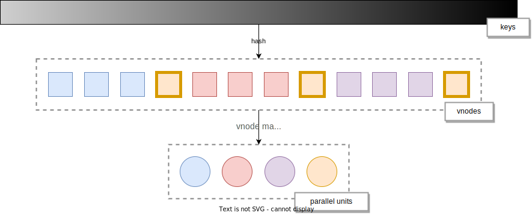
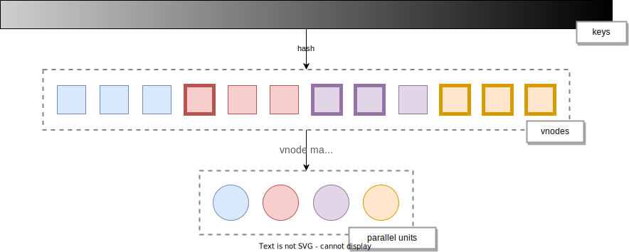

# Consistent Hash

## Background

When some node joins or leaves RisingWave cluster, the cluster needs to do scaling. [Actors](./streaming-overview.md#actors) will be recreated on the compute nodes after scaling and data (i.e. actors' states) require redistribution accordingly. 

In order to minimize data movement during data redistribution, we adopt **consistent hash strategy** to determine data distribution. 

## 

A hash function is applied to all keys in our system 

<!-- 

 -->

