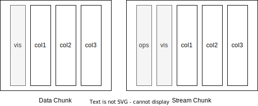
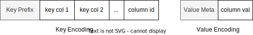

# Data Model and Encoding

- [Data Model and Encoding](#data-model-and-encoding)
  - [Data Model](#data-model)
  - [In-Memory Encoding](#in-memory-encoding)
  - [On-Disk Encoding](#on-disk-encoding)

<!-- Created by https://github.com/ekalinin/github-markdown-toc -->

## Data Model

> Source files: `common/src/types`

RisingWave adapts a relational data model with extensive support for semi-structured data. Relational tables, including tables and materialized views, consist of a list of named, strong-typed columns.

Tables created by users have an implicit, auto-generated row-id column as their primary key; while for materialized views, the primary key is derived from queries. For example, the primary key of an aggregation (group-by) materialized view is the specified group keys.

`NULL` values mean missing or unknown fields. Currently, all columns are implicitly nullable.

Primitive data types:

- Booleans: `BOOLEAN`
- Integers: `SMALLINT` (16-bit), `INT` (32-bit), `BIGINT` (64-bit)
- Decimals: `NUMERIC`
- Floating-point numbers: `REAL`, `DOUBLE`
- Strings: `VARCHAR`
- Temporals: `DATE`, `TIMESTAMP`, `TIMESTAMP WITH TIME ZONE`, `TIME`, `INTERVAL`

Composite data types (WIP):

- `Struct`: A structure with a list of named, strong-typed fields.
- `List`: A variable-length list of values with same data type.

## In-Memory Encoding

> Source files: `common/src/array`

In-memory data is encoded in arrays for vectorized execution. For variable-length data like strings, generally we use another offset array to mark the start of encoded values in a byte buffer. 

A Data Chunk consists of multiple columns and a visibility array, as is shown in the left subgraph below. The visibility array marks each row as visible or not. This helps filtering some rows while keeping other data arrays unchanged.

A Stream Chunk consists of columns, visibility array and an additional `ops` column, as is shown in the right subgraph below. The `ops` column marks the operation of row, which can be one of `Delete`, `Insert`, `UpdateDelete` and `UpdateInsert`.

## On-Disk Encoding

> Source files: `utils/memcomparable`, `utils/value-encoding`

RisingWave stores user data in shared key-value storage called 'Hummock'. Tables, materialized views and checkpoints of internal streaming operators are encoded into key-value entries. Every field of a row, a.k.a. cell, is encoded as a key-value entry, except that `NULL` values are omitted.

Considering that ordering matters in some cases, e.g. result set of an order-by query, fields of keys must preserve the order of original values after being encoded into bytes. This is what `memcomparable` is used for. For example, integers must be encoded in big-endian and the sign bit must be flipped to preserve order. In contrast, the encoding of values does not need to preserve order.

