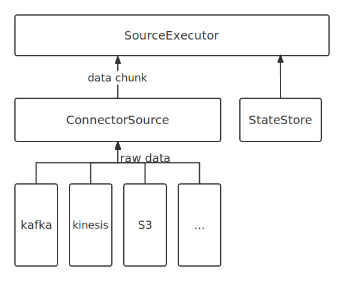

# Data Source

- [Data Source](#data-source)
  - [Components](#components)
    - [Connectors](#connectors)
    - [Enumerators](#enumerators)
    - [ConnectorSource](#connectorsource)
    - [SourceExecutor](#sourceexecutor)
  - [How It Works](#how-it-works)

This page describes RisingWave's Data Source API and the architecture behind it. This may help if you are interested in how data sources work, or if you want to implement a new Data Source.

## Components

RisingWave's data source covers four parts: connectors, enumerators, ConnectorSource and SourceExecutor.



### Connectors

`Connector` serve as an interface to upstream data pipeline, including the message queue and file system. In the current design, it does not have infinite concurrency. One connector instance only reads from one split from the upstream. For example, if upstream is a Kafka and it has three partitions so, in RisingWave, there should be three connectors.

All connectors need to implement the following trait and it exposes two methods to the upper layer.

```rust
// src/connector/src/base.rs
pub trait SplitReader: Sized {
    type Properties;

    async fn new(
        properties: Self::Properties,
        state: ConnectorState,
        columns: Option<Vec<Column>>,
    ) -> Result<Self>;
    async fn next(&mut self) -> Result<Option<Vec<SourceMessage>>>;
}
```

- `new`: create a new connector with some properties, and this method should support restoring from a specific state(with partitions and offsets).
- `next`: return a batch of new messages and their offsets in the split.

### Enumerators

`Enumerator` periodically requests upstream to discover changes in splits, and in most cases the number of splits only increases. The enumerator is a separate task that runs on the [meta](./meta-service.md). If the upstream split changes, the enumerator notifies the connector by means of config change to change the subscription relationship.

All enumerators need to implement the following trait.

```rust
// src/connector/src/base.rs
pub trait SplitEnumerator: Sized {
    type Split: SplitMetaData + Send + Sync;
    type Properties;

    async fn new(properties: Self::Properties) -> Result<Self>;
    async fn list_splits(&mut self) -> Result<Vec<Self::Split>>;
}
```

- `new`: creates an enumerator with some properties.
- `list_splits`: requests the upstream and returns all partitions.

### ConnectorSource

`ConnectorSource` unites all connectors via `SourceReader` trait. Also, a parser is held here, which parses raw data to stream chunks according to column description. A `ConnectorSource` can handle multiple splits by spawning a new thread for each split. If the source is assigned no split, it will start a dummy reader whose `next` method never returns as a placeholder.

### SourceExecutor

`SourceExecutor` is initialized with splits assigned by the enumerator to subscribe. The channel of the data chunks and the channel of the barrier are combined at this level and the `SourceExecutor` needs to prioritize and correctly handle the barriers.

## How It Works

1. When a source is defined, meta service will register its schema and broadcast to compute nodes. Compute node extracts properties from the frontend and builds corresponding components and stores them as `SourceDesc` in `source_manager` identified by table_id. Note that at this stage, the source instance is only built but not running.
2. No `SourceExecutor` will be built until a subsequent materialized view is created. `SourceExecutor` fetches specific source instance from `source_manager` identified by table_id and holds a copy of it, and initializes the corresponding state store at this stage.
3. When receiving a barrier, SourceExecutor will check whether it contains an assign_split mutation. If the partition assignment in the assign_split mutation is different from the current situation, the `SourceExecutor` needs to rebuild the `ConnectorSource` and other underlying services based on the information in the mutation, then starts reading from the new split and offset.
4. Whenever receiving a barrier, the state handler always takes a snapshot of the `ConnectorSource` then labels the snapshot with an epoch number. When an error occurs, SourceExecutor takes a specific state and applies it.
