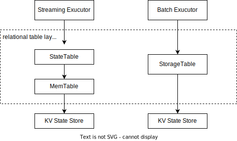

# Storing State Using Relational Table

<!-- toc -->

## Row-based Encoding

RisingWave adapts a relational data model. Relational tables, including tables and materialized views, consist of a list of named, strong-typed columns. All streaming executors store their data into a KV state store, which is backed by a service called Hummock. There are two choices to save a relational row into key-value pairs: cell-based format and row-based format. We choose row-based format because internal states always read and write the whole row, and don't need to partially update some fields in a row. Row-based encoding has better performance than cell-based encoding, which reduces the number of read and write kv pairs.

We implement a relational table layer as the bridge between executors and KV state store, which provides the interfaces accessing KV data in relational semantics. As the executor state's encoding is very similar to a row-based table, each kind of state is stored as a row-based relational table first. In short, one row is stored as a key-value pair. For example, encoding of some stateful executors in row-based format is as follows:

| state | key | value |
| ------ | --------------------- | ------ |
| mv     | table_id \| sort key \| pk | materialized value |
| top n | table_id \| sort key \| pk| materialized value |
| join     | table_id \| join_key \| pk | materialized value |
| agg | table_id \| group_key | agg_value |

<!-- Todo: link cconsistence hash doc and state table agg doc -->
## Relational Table Layer
[source code](https://github.com/risingwavelabs/risingwave/blob/4e66ca3d41435c64af26b5e0003258c4f7116822/src/storage/src/table/state_table.rs)

In this part, we will introduce how stateful executors interact with KV state store through the relational table layer.

Relational table layer consists of State Table, Mem Table and Storage Table. The State Table and MemTable is used in streaming mode, and Storage Table is used in batch mode.

State Table provides the table operations by these APIs: `get_row`, `scan`, `insert_row`, `delete_row` and `update_row`, which are the read and write interfaces for streaming executors. The Mem Table is an in-memory buffer for caching table operations during one epoch. The Storage Table is read only, and will output the partial columns  upper level needs.



### Write Path
To write into KV state store, executors first perform operations on State Table, and these operations will be cached in Mem Table. Once a barrier flows through one executor, executor will flush the cached operations into state store. At this moment, State Table will convert these operations into kv pairs and write to state store with specific epoch.

For example, an executor performs `insert(a, b, c)` and `delete(d, e, f)` through the State Table APIs, Mem Table first caches these two operations in memory. After receiving new barrier, State Table converts these two operations into KV operations by row-based format, and writes these KV operations into state store (Hummock).


### Read Path
In streaming mode, executors should be able to read the latest written data, which means uncommitted data is visible. The data in Mem Table (memory) is fresher than that in shared storage (state store). State Table provides both point-get and scan to read from state store by merging data from Mem Table and Storage Table.
#### Get
For example, let's assume that the first column is the pk of relational table, and the following operations are performed.
```
insert [1, 11, 111]
insert [2, 22, 222]
delete [2, 22, 222]
insert [3, 33, 333]

commit

insert [3, 3333, 3333]
```

After commit, a new record is inserted again. Then the `Get` results with corresponding pk are:
```
Get(pk = 1): [1, 11, 111]
Get(pk = 2):  None
Get(pk = 3): [3, 3333, 3333]
```

#### Scan
Scan on relational table is implemented by `StateTableIter`, which is a merge iterator of `MemTableIter` and `StorageIter`. If a pk exists in both KV state store (shared storage) and memory (MemTable), result of `MemTableIter` is returned. For example, in the  following figure, `StateTableIter` will generate `1->4->5->6` in order.




## Example: HashAgg

In this doc, we will take HashAgg with extreme state (`max`, `min`) or value state (`sum`, `count`) for example, and introduce a more detailed design for the internal table schema.

[Code](https://github.com/risingwavelabs/risingwave/blob/7f9ad2240712aa0cfe3edffb4535d43b42f32cc5/src/frontend/src/optimizer/plan_node/logical_agg.rs#L144)

### Table id
`table_id` is a globally unique id allocated in meta for each relational table object. Meta is responsible for traversing the Plan Tree and calculating the total number of Relational Tables needed. For example, the Hash Join Operator needs 2, one for the left table and one for the right table. The number of tables needed for Agg depends on the number of agg calls.

### Value State (Sum, Count)
Query example:
```sql
select sum(v2), count(v3) from t group by v1
```

This query will need to initiate 2 Relational Tables. The schema is `table_id/group_key`.

### Extreme State (Max, Min)
Query example:
```sql
select max(v2), min(v3) from t group by v1
```

This query will need to initiate 2 Relational Tables. If the upstream is not append-only, the schema becomes `table_id/group_key/sort_key/upstream_pk`.

The order of `sort_key` depends on the agg call kind. For example, if it's `max()`, `sort_key` will order with `Ascending`. if it's `min()`, `sort_key` will order with `Descending`.
The `upstream_pk` is also appended to ensure the uniqueness of the key.
This design allows the streaming executor not to read all the data from the storage when the cache fails, but only a part of it. The streaming executor will try to write all streaming data to storage, because there may be `update` or `delete` operations in the stream, it's impossible to always guarantee correct results without storing all data.

If `t` is created with append-only flag, the schema becomes `table_id/group_key`, which is the same for Value State. This is because in the append-only mode, there is no `update` or `delete` operation, so the cache will never miss. Therefore, we only need to write one value to the storage.
