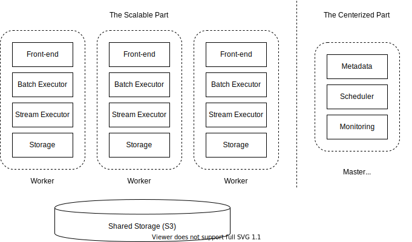
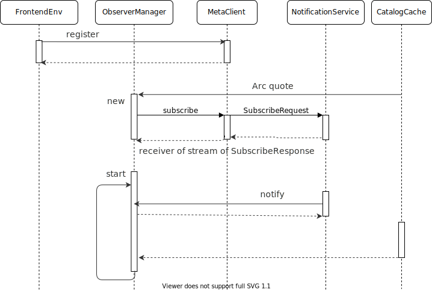

# Meta Service

- [Meta Service](#meta-service)
  - [Background](#background)
  - [Meta Store](#meta-store)
  - [Types of Metadata](#types-of-metadata)
    - [Catalog](#catalog)
    - [Storage](#storage)
  - [Push on Updates](#push-on-updates)

<!-- Created by https://github.com/ekalinin/github-markdown-toc -->

## Background

RisingWave provides both real-time analytical query as well as high-concurrent access to Materialized Views. Therefore, both the front-end and compute nodes are designed to be scalable, and they may share the same set of host machines or not, depending on cluster size and whether the user cares about resource isolation.

Meanwhile, components such as metadata provider, scheduler, monitoring are more suitable for a centralized design. For example, a typical on-premise deployment may look like below, where the dotted boxes represent minimal unit of deployment (VM or container).

## Meta Store

Metadata should be regarded as transactional data. Especially, we need guarantees like atomicity, consistency (e.g. read-after-write) and transaction support. Besides, it's not necessary to scale out it to multiple nodes.

We choose [etcd](https://etcd.io/) for production deployments, which is a replicated key-value storage based on B-Tree and Raft protocol.

To fit into the key-value data model, metadata entries are serialized with Protobuf as the value and the key is the ID or version of them, with respect to the kind of metadata.

## Types of Metadata
### Catalog

Catalog is the metadata of relational tables in databases. 

- **Database & Schema**: Namespace of database objects like in PostgreSQL.
- **Table & Materialized Views**: Definition of tables & materialized views along with the columns on them.
- **Source**: User-defined external data sources.

To execute a DDL statement like `CREATE` or `DROP TABLE`, the front-end sends an RPC to meta node and waits the updated catalog to take effect.

### Storage

Hummock, as an LSM-Tree-based storage, stores the mapping from version to the set of SSTable files in Meta Service. See more details in the [overview of State Store](./state-store-overview.md).

## Push on Updates

There are 2 choices for how to distribute information across multiple nodes. 

* *Push*: When metadata changes, the meta node tells all nodes to update, and master node must wait for others to acknowledge before continuing. 
* *Pull*: When data changes, the master node does nothing. Other nodes may not have the latest information, so they need to ask the master node every time.

Currently, for simplicity, we choose the push-style approach for all kinds of metadata. This is implemented as `NotificationService` on meta service and `ObserverManager` on front-end and compute nodes. 

`ObserverManager` will register itself to meta service on bootstrap and subscribe metadata it needs. Afterwards, once metadata changed, the meta node streams the changes to it, expecting all subscribers to acknowledge. 

