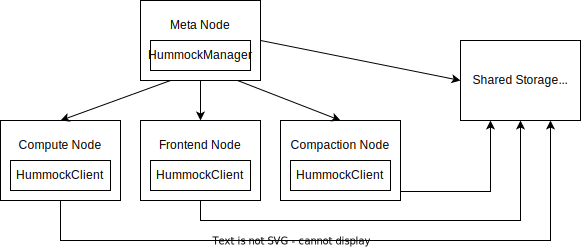
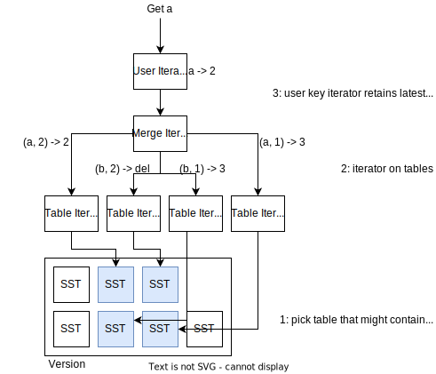
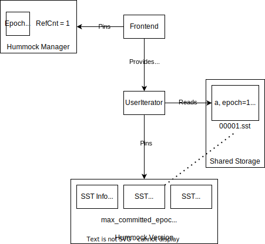
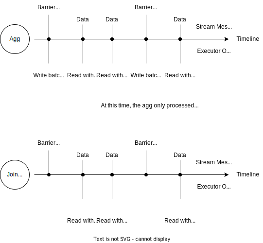

# An Overview of RisingWave State Store

- [An Overview of RisingWave State Store](#an-overview-of-risingwave-state-store)
  - [Overview](#overview)
  - [Architecture](#architecture)
  - [The Hummock User API](#the-hummock-user-api)
  - [Hummock Internals](#hummock-internals)
    - [Storage Format](#storage-format)
    - [Write Path](#write-path)
    - [Read Path](#read-path)
    - [Compaction](#compaction)
    - [Transaction Management with Hummock Manager](#transaction-management-with-hummock-manager)
    - [Checkpointing in Streaming](#checkpointing-in-streaming)

<!-- Created by https://github.com/ekalinin/github-markdown-toc -->

## Overview

In RisingWave, all streaming executors store their data into a state store. This KV state store is backed by a service called Hummock, a cloud-native LSM-Tree-based storage engine. Hummock provides key-value API, and stores all data on S3-compatible service. However, it is not a KV store for general purpose, but a storage engine co-designed with RisingWave streaming engine and optimized for streaming workload.

## Architecture

Reading this document requires prior knowledge of LSM-Tree-based KV storage engines, like RocksDB, LevelDB, etc.



Hummock consists of manager service on meta node, clients on worker nodes (including compute nodes, frontend nodes, and compactor nodes), and a shared storage to store files (SSTs). Every time a new write batch is produced, Hummock client will upload those files to shared storage, and notify the Hummock manager of the new data. With compaction going on, new files will be added and unused files will be vacuumed. The Hummock manager will take care of the lifecycle of a file — is a file is being used? can we delete a file? etc.

Streaming state store has distinguished workload characteristics.

* Every streaming executor will only ***read and write its own portion of data***, which are multiple consecutive non-overlapping ranges of keys (we call it ***key space***).
* Data (generally) ***won’t be shared across nodes***, so every worker node will only read and write its own data. Therefore, every Hummock API, like `get` or `scan`, only guarantees writes on one node can be immediately read from the same node. In some cases, if we want to read data written from other nodes, we will need to ***wait for the epoch***.
* Streaming data are ***committed in serial***. Based on the [barrier-based checkpoint algorithm](https://en.wikipedia.org/wiki/Chandy%E2%80%93Lamport_algorithm), the states are persisted epoch by epoch. We can tailor the write path specifically for the epoch-based checkpoint workload.

This leads to the design of Hummock, the cloud-native KV-based streaming state store. We’ll explain concepts like “epoch”, “key space” and “barrier” in the following chapters.

## The Hummock User API

[source code](https://github.com/risingwavelabs/risingwave/blob/main/src/storage/src/hummock/mod.rs)

In this part, we will introduce how users can use Hummock as a KV store.

The Hummock itself provides 3 simple APIs: `ingest_batch`, `get`, and `scan`. Hummock provides MVCC write and read on KV pairs. Every key stored in Hummock has an *epoch* (aka. timestamp). Developers should specify an epoch when calling Hummock APIs.

Hummock doesn’t support writing a single key. To write data into Hummock, users should provide a ***sorted, unique*** list of ***keys*** and the corresponding ***operations*** (put value, delete), with an ***epoch***, and call the `ingest_batch` API. Therefore, within one epoch, users can only have one operation for a key. For example,

```
[a => put 1, b => put 2] epoch = 1 is a valid write batch
[a => put 1, a => delete, b => put 2] epoch = 1 is an invalid write batch
[b => put 1, a => put 2] epoch = 1 is an invalid write batch
```

For reads, we can call `scan` and `get` API on Hummock client. Developers need to specify a read epoch for read APIs. Hummock only guarantees writes on one node can be immediately read from the same node. Let’s take a look at the following example:

```
Node 1: write a => 1, b => 2 at epoch 1
Node 1: write a => 3, b => 4 at epoch 2
Node 2: write c => 5, d => 6 at epoch 2
```

After all operations have been done,

```
Read at epoch 2 on Node 1: a => 3, b => 4, (c => 5, d => 6 may be read)
Read at epoch 1 on Node 1: a => 1, b => 2
Read at epoch 2 on Node 2 with `wait_epoch 2`: a => 3, b => 4, c => 5, d => 6
```


## Hummock Internals

In this part, we will discuss how data are stored and organized in Hummock internally. If you will develop Hummock, you should learn some basic concepts, like SST, key encoding, read / write path, consistency, from the following sections.

### Storage Format

[SST encoding source code](https://github.com/risingwavelabs/risingwave/tree/main/src/storage/src/hummock/sstable)

All key-value pairs are stored in block-based SSTables. Each user key is associated with an epoch. In SSTs, key-value pairs are sorted first by user key (lexicographical order), and then by epoch (largest to smallest).

For example, if users write two batches in consequence:

```
write a => 1, b => 2 at epoch 1
write a => delete, b => 3 at epoch 2
```

After compaction (w/ min watermark = 0), there will eventually be an SST with the following content:

```
(a, 2) => delete
(a, 1) => 1
(b, 2) => 3
(b, 1) => 2
```

The final written key (aka. full key) is encoded by appending the 8-byte epoch after the user key. When doing full key comparison in Hummock, we should always compare full keys using the `VersionedComparator` to get the correct result.

### Write Path

Hummock client will batch writes and generate SSTs to sync to the underlying S3-compatible service. An SST consists of two files:
- <id>`.data`: Data file composed of ~64KB blocks, each of which contains actual key-value pairs.
- <id>`.meta`: Meta file containing large metadata including min-max index, Bloom filter as well as data block metadata.

After the SST is uploaded to an S3-compatible service, Hummock client will let the Hummock manager know there’s a new table.
The list of all SSTs along with some metadata forms a ***version***. When Hummock client adds new SSTs to the Hummock manager, a new version will be generated with the new set of SST files.


### Read Path

To read from Hummock, we need a ***version*** (a consistent state of list of SSTs we can read) and ***epoch*** to generate a consistent read snapshot. To avoid RPC with Hummock manager in every user read, the Hummock client will cache a most recent ***version*** locally. Local version will be updated when 1) client initiates a write batch and 2) background refresher triggers.

For every read operation (`scan`, `get`), we will first select SSTs that might contain the required keys.

For `scan`, we simply select by overlapping key range. For point get, we will filter SSTs further by Bloom filter. After that, we will compose a single `MergeIterator` over all SSTs. The `MergeIterator` will return all keys in range along with their epochs. Then, we will create `UserIterator` over `MergeIterator`, and for all user keys, the user iterator will pick the first full key whose epoch <= read epoch. Therefore, users can perform snapshot read from Hummock based on the given epoch. The snapshot should be acquired beforehand and released afterwards.



Hummock implements the following iterators:
- `BlockIterator`: iterates a block of an SSTable.
- `SSTableIterator`: iterates an SSTable.
- `ConcatIterator`: iterates SSTables with non-overlapping keyspaces.
- `MergeIterator`: iterates SSTables with overlapping keyspaces.
- `UserIterator`: wraps internal iterators and outputs user key-value with epoch <= read epoch.

[iterators source code](https://github.com/risingwavelabs/risingwave/tree/main/src/storage/src/hummock/iterator)


### Compaction

Currently, Hummock is using a compaction strategy similar to leveled-compaction in RocksDB. It will compact data using consistent hash (docs and implementation TBD), so that data on shared storage distribute in the same way as how stream executors use them.

Compaction is done on a special worker node called compactor node. The standalone compactor listens for compaction jobs from meta node, compacts one or more SSTs into new ones, and reports completion to the meta node. (In Hummock in-memory mode, compactor will be running as a thread inside compute node.)

To support MVCC read without affecting compaction, we track the epoch low watermark in Hummock snapshots. A user key-value pair will be retained if (1) it is the latest, or (2) it belongs to an epoch above the low watermark.

### Transaction Management with Hummock Manager

[source code of Hummock manager on meta service](https://github.com/risingwavelabs/risingwave/tree/main/src/meta/src/hummock)

In this part, we discuss how Hummock coordinates between multiple compute nodes. We will introduce key concepts like “snapshot”, “version”, and give examples on how Hummock manages them.

Every operation on the LSM-tree yields a new ***version*** on Hummock manager, e.g., adding new L0 SSTs and compactions. In streaming, each stream barrier is associated with an ***epoch***. When the barrier flows across the system and collected by the stream manager, we can start doing ***checkpoint*** on this epoch. SSTs produced in a single checkpoint are associated with an ***uncommitted epoch***. After all compute nodes flush shared buffers to shared storage, Hummock manager considers the epoch committed. Therefore, apart from the list of files in LSM, a version also contains committed epoch number `max_committed_epoch` and SSTs in uncommitted epochs. As a result, both an ***operation on LSM*** and a ***streaming checkpoint*** will yield a new ***version*** in Hummock manager.

Currently, there is only one checkpoint happening in the system at the same time. In the future, we might support more checkpoint optimizations including concurrent checkpointing.

As mentioned in [Read Path](#read-path), reads are performed on a ***version*** based on a given ***epoch***. During the whole read process, data from the specified read epoch cannot be removed by compaction, which is guaranteed by ***pinning a snapshot***; SSTs within a ***version*** cannot be vacuumed by compaction, which is guaranteed by ***pinning a version***.

The SQL frontend will get the latest epoch from meta service. Then, it will embed the epoch number into SQL plans, so that all compute nodes will read from that epoch. In theory, both SQL frontend and compute nodes will ***pin the snapshot***, to handle the case that frontend goes down and the compute nodes are still reading from Hummock (#622). However, to simplify the process, currently we ***only pin on the frontend side***.



Hummock only guarantees that writes on one node can be immediately read from the same node. However, the worker nodes running batch queries might have a slightly outdated version with a batch query plan is received (due to the local version caching). Therefore, we have a `wait_epoch` interface to wait until the local cached version contains full data of one epoch.

When there is no reference to a version, all file deletions in this version can be actually applied. There is a background vacuum task dealing with the actual deletion.

### Checkpointing in Streaming

[related PR](https://github.com/risingwavelabs/risingwave/pull/602)

Now we discuss how streaming executors and streaming manager use Hummock as a state store.

From the perspective of the streaming executors, when they receive a barrier, they will be “in the new epoch”. For data received in epoch 1, they will be persisted (write batch) with epoch 1. Receiving the barrier also causes the read and write epoch being set to the new one.

Here we have two cases: Agg executors always persist and produce new write batches when receiving a barrier; Join executors (in the future when async flush gets implemented) will produce write batches within an epoch.



Streaming executors cannot control when data will be persisted — they can only write to Hummock `shared buffer`. When a barrier flows across the system and is collected by meta service, we can ensure that all executors have written their states of ***the previous epoch*** to the shared buffer, so we can initiate checkpoint process on all worker nodes, and upload SSTs to persistent remote storage.

For example, the barrier manager sends barrier epoch = 2. When the epoch 2 barrier is collected on meta service, we can ensure that data prior to epoch 2 have been fully flushed to Hummock shared buffer. (Note that epoch number in streaming is generated by machine time + serial number, so ***we cannot simply use +1 -1 to determine the epoch of the previous / next barrier***.) Assuming the previous barrier is of epoch 1, we can start checkpointing data from epoch 1 after barrier of epoch 2 has been collected.
