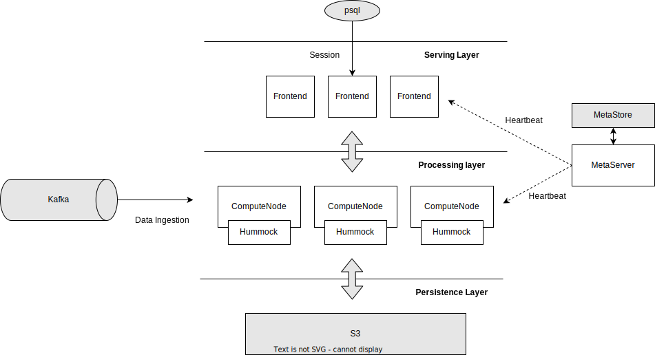
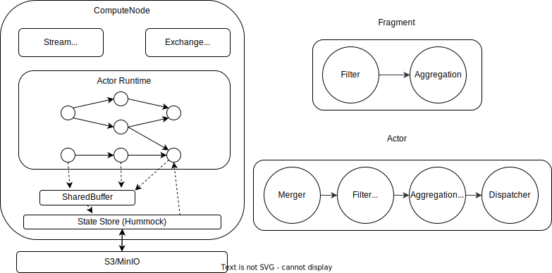

# An Overview of the RisingWave Streaming Engine

- [An Overview of the RisingWave Streaming Engine](#an-overview-of-risingwave-streaming-engine)
  - [Overview](#overview)
  - [Architecture](#architecture)
  - [Actors, executors, and states](#actors-executors-and-states)
    - [Actors](#actors)
    - [Executors](#executors)
  - [Checkpoint, Consistency, and Fault tolerance](#checkpoint-consistency-and-fault-tolerance)
    - [Barrier based checkpoint](#barrier-based-checkpoint)
    - [Fault tolerance](#fault-tolerance)

<!-- Created by https://github.com/ekalinin/github-markdown-toc -->

## Overview

RisingWave provides real-time analytics to serve user’s need. This is done by defining materialized views (MV). All materialized views will be automatically refreshed according to recent updates, such that querying materialized views will reflect real-time analytical results. Such refreshing is carried out by our RisingWave streaming engine.

The core design principles of the RisingWave streaming engine are summarized as follows. 

* **Actor model based execution engine.** We create a set of actors such that each actor reacts to its own input message, including both data update and control signal. In this way we build a highly concurrent and efficient streaming engine.
* **Shared storage for states.** The backbone of the state storage is based on shared cloud object storage (currently AWS S3), which gives us computational elasticity, cheap and infinite storage capacity, and simplicity during configuration change.
* **Everything is a table, everything is a state.** We treat every object in our internal storage as both a logical table and an internal state. Therefore, they can be effectively managed by catalog, and be updated in a unified streaming engine with consistency guarantee.

In this document we give an overview of the RisingWave streaming engine. 

## Architecture

The overall architecture of RisingWave is depicted in the figure above. In brief, RisingWave streaming engine consists of three sets of nodes: frontend, compute nodes, and meta service. The frontend node consists of the serving layer, handling users’ SQL requests concurrently. Underlying is the processing layer. Each compute node hosts a collection of long-running actors for stream processing. All actors access a shared persistence layer of storage (currently AWS S3) as its state storage. The meta service maintains all meta-information and coordinates the whole cluster. 

When receiving a create materialized view statement at the frontend, a materialized view and the corresponding streaming pipeline are built in the following steps.

1. Building a stream plan. Here a stream plan is a logical plan which consists of logical operators encoding the dataflow. This is carried out by the streaming planner at the frontend.
2. Fragmentation. The stream fragmenter at the meta service breaks the generated logical stream plan into stream fragments, and duplicates such fragments when necessary. Here a stream fragment holds partial nodes from the stream plan, and each fragment can be parallelized by building multiple actors for data parallelization.
3. Scheduling plan fragments. The meta service distributes different fragments into different compute nodes and let all compute nodes build their local actors. 
4. Initializing the job at the backend. The meta service notifies all compute nodes to start serving streaming pipelines. 
## Actors, executors, and states

### Actors

Actors are the minimal unit to be scheduled in the RisingWave streaming engine, such that there is no parallelism inside each actor. The typical structure of an actor is depicted on the right of the figure above. An actor consists of three parts.

* Merger (optional). Each merger merges the messages from different upstream actors into one channel, such that the executors can handle messages sequentially. The merger is also in charge of aligning barriers to support checkpoints (details described later). 
* A chain of executors. Each executor is the basic unit of delta computation (details described later). 
* Dispatcher (optional). Each dispatcher will send its received messages to different downstream actors according to certain strategies, e.g. hash shuffling or round-robin.

The execution of actors is carried out by tokio async runtime. After an actor starts running, it runs an infinite loop in which it continuously runs async functions to generate outputs, until it receives a stop message. 

Messages between two local actors are transferred via channels. For two actors located on different compute nodes, messages are re-directed to an exchange service. The exchange service will continuously exchange messages with each other via RPC requests. 

### Executors

Executors are the basic computational units in the streaming engine. Each executor responds to its received messages and computes an output message atomically, i.e the computation inside each executor will not be broken down. 

The underlying algorithmic framework of the RisingWave streaming system is the traditional change propagation framework. Given a materialized view to be maintained, we build a set of executors where each executor corresponds to a relational operator (including base table). When any of the base tables receive an update, the streaming engine computes the changes to each of the materialized views by recursively computing the update from the leaf to the root. Each node receives an update from one of its children, computes the local update, and propagates the update to its parents. By guaranteeing the correctness of every single executor, we get a composable framework for maintaining arbitrary SQL queries.

## Checkpoint, Consistency, and Fault tolerance

We use the term consistency to denote the model of the *completeness and correctness* of querying materialized views. We follow the consistency model introduced in [Materialize](https://materialize.com/blog/consistency/). More specifically, the system assures that the query result is always a consistent snapshot of a certain timestamp t before the query issued a timestamp. Also, later queries always get consistent snapshots from a later timestamp. A consistent snapshot at t requires that all messages no later than t are reflected in the snapshot exactly once while all messages after t are not reflected. 

### Barrier based checkpoint

To guarantee consistency, RisingWave introduces a Chandy-Lamport style consistent snapshot algorithm as its checkpoint scheme. 

This procedure guarantees that every state to be flushed into the storage is consistent (matching a certain barrier at the source). Therefore, when querying materialized views, consistency is naturally guaranteed when the batch engine reads a consistent snapshot (of views and tables) on the storage. We also call each barrier an epoch and sometimes use both terms interchangeably as data streams are cut into epochs. In other words, the write to the database is visible only after it has been committed to the storage via the checkpoint.

To improve the efficiency, all dirty states on the same compute node are gathered to a shared buffer, and the compute node asynchronously flushes the whole shared buffer into a single SST file in the storage, such that the checkpoint procedure shall not block stream processing. 

See more detailed descriptions on [Checkpoint](./checkpoint.md).

### Fault tolerance

When the streaming engine crashes down, the system must globally rollback to a previous consistent snapshot. To achieve this, whenever the meta detects the failover of some certain compute node or any undergoing checkpoint procedure, it triggers a recovery process. After rebuilding the streaming pipeline, each executor will reset its local state from a consistent snapshot on the storage and recover its computation. 

