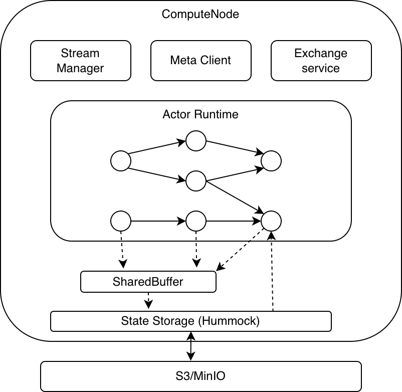

# An Overview of RisingWave Streaming Engine

## Overview

Risingwave provides real time analytical results to serve user’s need. This is done by defining materialized views (MV). All materialized views will be automatically refreshed according to recent updates, such that querying materialized views will reflect real time analytical results. Such refreshing is carried out by our RisingWave streaming engine. 

The core design principles of RisingWave streaming engine are summarized as follows. 

* Actor model based execution engine.* We create a set of actors such that each actor react to its own input message, including both data update and control signal. In this way we build a highly concurrent and efficient streaming engine. 
* Shared storage for states.* The backbone of the state storage is based on sharing cloud block storage (currently AWS S3), which give us computational elasticity,  cheap and infinite storage capacity, and simplicity in configuration change.  
* Everything is a table, everything is a state.* We treat every object in our internal storage as both a logical table and an internal state. Therefore they can be effectively managed by catalog, and be updated in a unified streaming engine with consistency guarantee. 

In this document we give an overview of RisingWave streaming engine. We begin with a recap some backgrounds. Then we introduce the compute node architecture. Next we dive into details about the design of actors, checkpoint, consistency, fault tolerance, and configuration change. We continue our discussions on some advanced features in the streaming engine. Finally we summarize frequently mentioned concepts in a table. 

## Background: Overall architecture

The overall architecture of Risingwave is depicted in the figure above. In this document, we mainly focus on the compute node side, and explains on how the streaming engine is designed on the compute node. 

## Actor model

Our execution engine is highly inspired by the actor model for concurrent computation. In actor model, every computational entity is an *actor*. All actor run concurrently, and they response to message they receive by:

* Send a finite number of messages to other actors;
* Modify its local state to handle future messages. 

As discussed in [Wikipedia](https://en.wikipedia.org/wiki/Actor_model): 

> The actor model is characterized by inherent concurrency of computation within and among actors, dynamic creation of actors, inclusion of actor addresses in messages, and interaction only through direct asynchronous message passing with no restriction on message arrival order.

The philosophy of actor model lies at the core of our design principle of streaming engine. We divide streaming pipeline into actors, and actor only response to its received messages. The overall correctness of streaming engine is collectively guaranteed by the internal logic of each actor. 

## Frontend

When receiving a create materialized view statement at the front end, a materialized view and the corresponding streaming pipeline are built in following steps.  

1. Building a stream plan. Here a stream plan is a logical plan which consists of logical operators encoding the dataflow. This is carried out by the streaming planner at the front-end.
2. Stream fragmenter. The stream fragmenter at the meta service breaks the generated logical stream plan into stream fragments, and duplicates such fragments when necessary. Here a stream fragment holds partial nodes from the stream plan, and each fragment can be parallelized by building multiple actors for data parallelization.
3. Scheduling plan fragments. The meta services distributes different fragments into different compute nodes and let all compute nodes build their local actors. 
4. Initialize the job at the backend. The meta services 

## Compute node architecture

The streaming engine consists of multiple compute nodes (CN), where each compute node is equipped with some submodules, including:

* Stream manager. The stream manager is in charge of initializing control signals to actors. 
* Exchange service. For communication 
* Actor runtime.
* State storage.

## Executor, actor and states

TODO

## Checkpoint, Consistency and Fault tolerance

We use the term consistency to denote the model of the *completeness and correctness* of querying materialized view. We follow the consistency model introduced in [Materialize](https://materialize.com/blog-consistency/). More specifically, the system assures that the query result is always a consistent snapshot of a certain timestamp t before the query issue timestamp, and later queries always get consistent snapshots from later timestamp. A consistent snapshot at t requires that all messages no later than t are reflected in the snapshot exactly once while all messages after t are not reflected. 

To guarantee consistency, TODO

## Configuration change

TODO

