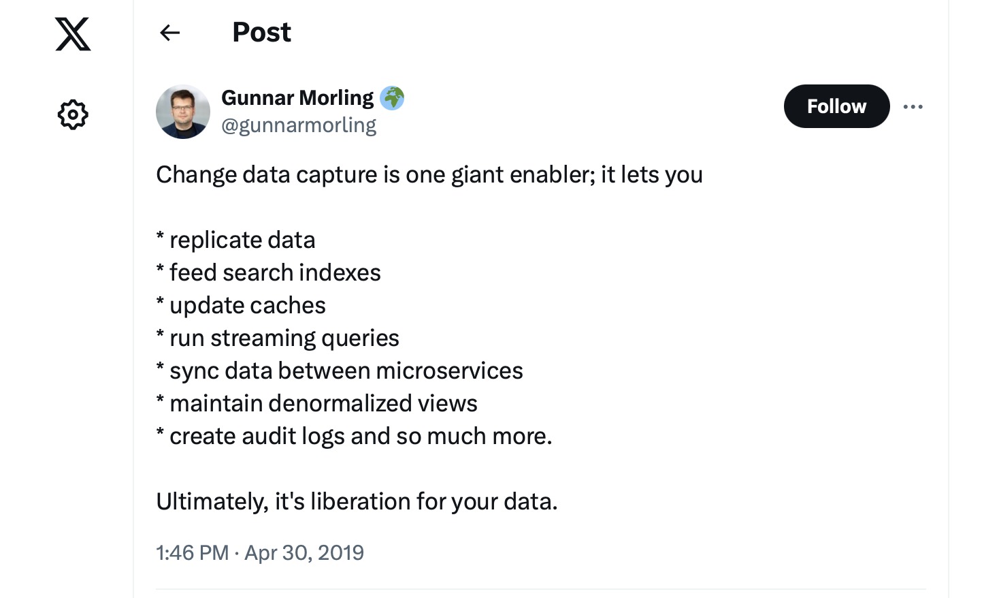

# Presentation TiDB + RisingWave

## Intro to streaming

...

## Intro to RisingWave

...


## Demo

```sh

docker volume rm   risingwave-compose_minio-0 risingwave-compose_etcd-0 risingwave-compose_grafana-0 risingwave-compose_prometheus-0
cd /Users/janmensch/Documents/github/risingwave
docker compose -f integration_tests/tidb-cdc-sink/docker-compose.yml up
./integration_tests/tidb-cdc-sink/prepare.sh

# Connect against TiDB
mysql -h localhost --protocol=TCP -u root -P 4000
show databases;
show tables;
select * from tweet limit 10;
select count(1) from tweet; 

# connect against RW
pcon
show databases;
use dev;
show tables;
select * from tweet limit 10;

# back to TiDB
show tables;
# show that 
```

- This is the big streaming demo 
- Showing how to get data from TiDB to RW
    - New files created e.g. if `max_binlog_size` is reached or on restart

## Intro to Capture Data Change (CDC) 

- Purpose of CDC
  - Quickly get data from one DB to a different DB
  - Derived databases: You have your OLTP DB and then a derived cache, search index, OLAP or stream processor



## Where does CDC come from? 

- Logging in DBs
  - You do a commit, before confirming the commit, the DB needs to persist
  - Persisting to many different DB files may be slow 
  - If DB crashes it can then recover from log files
  - It is faster to use an append only file i.e. a log
  - Originally these files were meant for internal use only

- TODO: Connection to Transactions?

- CDC implementation consumes these logs
  - CDC then emits events and pushes them to e.g. Kafka
  - Example CDC implementation: Debezium
  
## CDC Demo 

- New, simpler demo, because changes are easier to observe here

```sh 
# start the setup 
cd /Users/janmensch/Documents/github/risingwave; git checkout cajan93/presentation-london-tidb 
docker compose -f presentation_london/docker-compose-debezium.yml up

# We have a mysql source, a debezium connector, and a kafka to transport the change events
docker ps
CONTAINER ID   IMAGE                                   COMMAND                  CREATED          STATUS          PORTS                                                                    NAMES
838f78ce665c   quay.io/debezium/connect:latest         "/docker-entrypoint.…"   11 seconds ago   Up 10 seconds   8778/tcp, 0.0.0.0:8083->8083/tcp, 9092/tcp                               presentation_london-connect-1
a0732e1a8894   quay.io/debezium/kafka:latest           "/docker-entrypoint.…"   11 seconds ago   Up 10 seconds   0.0.0.0:9093->9092/tcp                                                   presentation_london-kafka-1
8e2a49cb75b0   quay.io/debezium/zookeeper:latest       "/docker-entrypoint.…"   11 seconds ago   Up 10 seconds   0.0.0.0:2888->2888/tcp, 0.0.0.0:3888->3888/tcp, 0.0.0.0:2182->2181/tcp   presentation_london-zookeeper-1
af3a840a46b4   quay.io/debezium/example-mysql:latest   "docker-entrypoint.s…"   11 seconds ago   Up 10 seconds   0.0.0.0:3306->3306/tcp, 33060/tcp                                        presentation_london-mysql-1

mysql -h localhost --protocol=TCP -u root -P 3306 -p
# debezium

show databases;
use inventory;
show tables;
select * from customers;

show binary logs;

# let's really see the files

docker exec -it  presentation_london-mysql-1 sh
cd /var/lib/mysql
ls
# show binary logs
cat mysql-bin.index
head mysql-bin.000002
# indeed bin logs 

# insert data
insert into customers (first_name, last_name, email) values ("evil", "eve", "ee@gmail.com");
show binary logs;
delete from customers where last_name = "eve";
show binary logs; # More or less data in binlog?
insert into customers (first_name, last_name, email) values ("evil", "eve", "ee@gmail.com");
update customers set first_name = "good" where last_name = "eve";

# view the log
docker cp   presentation_london-mysql-1:/var/lib/mysql/mysql-bin.000003 ~/Downloads/binlog
mysqlbinlog  ~/Downloads/binlog --base64-output=decode-rows --verbose -v

# start CDC
curl -i -X POST -H "Accept:application/json" -H "Content-Type:application/json" localhost:8083/connectors/ -d '{ "name": "inventory-connector", "config": { "connector.class": "io.debezium.connector.mysql.MySqlConnector", "tasks.max": "1", "database.hostname": "mysql", "database.port": "3306", "database.user": "debezium", "database.password": "dbz", "database.server.id": "184054", "topic.prefix": "dbserver1", "database.include.list": "inventory", "schema.history.internal.kafka.bootstrap.servers": "kafka:9092", "schema.history.internal.kafka.topic": "schemahistory.inventory" } }'


docker exec presentation_london-kafka-1 /kafka/bin/kafka-console-consumer.sh --bootstrap-server kafka:9092 --from-beginning --topic dbserver1.inventory.customers  | grep good
echo ... | jq .payload
# Why does this look like an initial write? Snapshotting

update customers set first_name = "good and very smart" where last_name = "eve";
echo ... | jq .payload
# now you also have an update event
```

- Lets have a look at the actual the logs which we mentioned earlier

```sh 
# password is debezium
mysql -h localhost --protocol=TCP -u root -P 3306 -p

# The current data in the system
use inventory; 
show tables;
select * from customers;

show binary logs;
+------------------+-----------+-----------+
| Log_name         | File_size | Encrypted |
+------------------+-----------+-----------+
| mysql-bin.000001 |       180 | No        |
| mysql-bin.000002 |   3050181 | No        |
| mysql-bin.000003 |       157 | No        |
+------------------+-----------+-----------+

insert into customers (first_name, last_name, email) values ("evil", "eve", "ee@gmail.com");

show binary logs;
+------------------+-----------+-----------+
| Log_name         | File_size | Encrypted |
+------------------+-----------+-----------+
| mysql-bin.000001 |       180 | No        |
| mysql-bin.000002 |   3050181 | No        |
| mysql-bin.000003 |       488 | No        |
+------------------+-----------+-----------+
```

- We can see multiple binlogs
- We can observe that we are writing into binlog 3, because that is the one where the size increased
  - File size will also increase on deletes

```sh 
delete from customers where first_name = "evil";
show binary logs;
+------------------+-----------+-----------+
| Log_name         | File_size | Encrypted |
+------------------+-----------+-----------+
| mysql-bin.000001 |       180 | No        |
| mysql-bin.000002 |   3050181 | No        |
| mysql-bin.000003 |       819 | No        |
+------------------+-----------+-----------+

# I will also do this. We will get to that in a minute
insert into customers (first_name, last_name, email) values ("very evil", "eve", "ee@gmail.com");
update customers set first_name= "good" where first_name = "very evil";

# We can also observe the binlogs as actual files
docker exec   presentation_london-mysql-1 ls -alh /var/lib/mysql | grep mysql-bin
-rw-r----- 1 mysql mysql  180 May  9 14:50 mysql-bin.000001
-rw-r----- 1 mysql mysql 3.0M May  9 14:50 mysql-bin.000002
-rw-r----- 1 mysql mysql 1.5K May  9 15:07 mysql-bin.000003
-rw-r----- 1 mysql mysql   57 May  9 14:50 mysql-bin.index

# Index tells the DB which binlogs we currently have available
docker exec presentation_london-mysql-1 cat /var/lib/mysql/mysql-bin.index 
./mysql-bin.000001
./mysql-bin.000002
./mysql-bin.000003
```


- Let's have a look at the binlog

```sh
docker cp presentation_london-mysql-1:/var/lib/mysql/mysql-bin.000003 ~/Downloads/binlog 

# Indeed binary gibberish...
head ~/Downloads/binlog 
bbin��<fphz~8.2.0��<f�

mysqlbinlog  ~/Downloads/binlog --base64-output=decode-rows --verbose
BEGIN
/*!*/;
# at 649
#240509 16:57:43 server id 223344  end_log_pos 723 CRC32 0xf4f95815     Table_map: `inventory`.`customers` mapped to number 92
# has_generated_invisible_primary_key=0
# at 723
#240509 16:57:43 server id 223344  end_log_pos 788 CRC32 0x520cb866     Delete_rows: table id 92 flags: STMT_END_F
### DELETE FROM `inventory`.`customers`
### WHERE
###   @1=1005
###   @2='evil'
###   @3='eve'
###   @4='ee@gmail.com'
# at 788
#240509 16:57:43 server id 223344  end_log_pos 819 CRC32 0xf1b01425     Xid = 19
COMMIT/*!*/;
```

- Above you can see an example message from the binlog 
  - `BEGIN` and `COMMIT` mark the beginning and end of the transaction 
  - You can see the timestamp and the server id 
  - Mapping of table to internal table number: `Table_map: inventory.customers mapped to number 92`
  - `end_log_pos 788`: Offset in the binlog
  - `DELETE FROM...` pseudo SQL statement
    - `@1` represents the first column in our table
    - This is also why deleting takes up more space in the binlog: We append a delete event
- TODO: What do the other things say here?

- Lets consume the binlog using debezium CDC

```sh 
# register connector with
curl -i -X POST -H "Accept:application/json" -H "Content-Type:application/json" localhost:8083/connectors/ -d '{ "name": "inventory-connector4", "config": { "connector.class": "io.debezium.connector.mysql.MySqlConnector", "tasks.max": "1", "database.hostname": "mysql", "database.port": "3306", "database.user": "debezium", "database.password": "dbz", "database.server.id": "184054", "topic.prefix": "dbserver1", "database.include.list": "inventory", "schema.history.internal.kafka.bootstrap.servers": "kafka:9092", "schema.history.internal.kafka.topic": "schemahistory.inventory" } }'

# We now have new topics
docker exec  presentation_london-kafka-1 /kafka/bin/kafka-topics.sh  --bootstrap-server kafka:9092 --list
__consumer_offsets
dbserver1
dbserver1.inventory.addresses
dbserver1.inventory.customers
dbserver1.inventory.geom
dbserver1.inventory.orders
dbserver1.inventory.products
dbserver1.inventory.products_on_hand
my_connect_configs
my_connect_offsets
my_connect_statuses
schemahistory.inventory

# Let's view the actual events. We earlier added and updated Eve's record
docker exec presentation_london-kafka-1 /kafka/bin/kafka-console-consumer.sh --bootstrap-server kafka:9092 --from-beginning --topic dbserver1.inventory.customers | grep "ee@gmail"
```

- If we pipe above into `jq .payload`

```json
{
  "before": null,
  "after": {
    "id": 1006,
    "first_name": "good",
    "last_name": "eve",
    "email": "ee@gmail.com"
  },
  "source": {
    "version": "2.6.1.Final",
    "connector": "mysql",
    "name": "dbserver1",
    "ts_ms": 1715268140000,
    "snapshot": "last_in_data_collection",
    "db": "inventory",
    "sequence": null,
    "ts_us": 1715268140000000,
    "ts_ns": 1715268140000000000,
    "table": "customers",
    "server_id": 0,
    "gtid": null,
    "file": "mysql-bin.000003",
    "pos": 1531,
    "row": 0,
    "thread": null,
    "query": null
  },
  "op": "r",
  "ts_ms": 1715268140631,
  "ts_us": 1715268140631937,
  "ts_ns": 1715268140631937000,
  "transaction": null
}
```
- Even though we updated the record we do not see an update event 
  - `"before": null,` indicates an initial write
  - Why is that? Any ideas?
- CDC tools like debezium will do an initial snapshotting
  - They need to do this to consume existing data from the binlog
  - You will not be able to observe a delete event either, since we did not observe it
  - Debezium right now only reports the initial snapshot

- Let's obverse an update event 

```sh 
update customers set first_name="very smart and good" where last_name="eve";
docker exec   presentation_london-kafka-1 /kafka/bin/kafka-console-consumer.sh --bootstrap-server kafka:9092 --from-beginning --topic dbserver1.inventory.customers | grep 'ee@gmail'
```

- ... with `jq .payload`

```json
{
  "before": {
    "id": 1006,
    "first_name": "good",
    "last_name": "eve",
    "email": "ee@gmail.com"
  },
  "after": {
    "id": 1006,
    "first_name": "very smart and good",    # the col which changed
    "last_name": "eve",
    "email": "ee@gmail.com"
  },
  "source": {
    "version": "2.6.1.Final",
    "connector": "mysql",
    "name": "dbserver1",
    "ts_ms": 1715268875000,
    "snapshot": "false",
    "db": "inventory",
    "sequence": null,
    "ts_us": 1715268875000000,
    "ts_ns": 1715268875000000000,
    "table": "customers",
    "server_id": 223344,
    "gtid": null,
    "file": "mysql-bin.000003",             # the bin log file which contains the record
    "pos": 1775,
    "row": 0,
    "thread": 8,
    "query": null
  },
  "op": "u",                                # update operation
  "ts_ms": 1715268875313,
  "ts_us": 1715268875313027,
  "ts_ns": 1715268875313027000,
  "transaction": null
}
```

- This events can now be consumed by a downstream DB